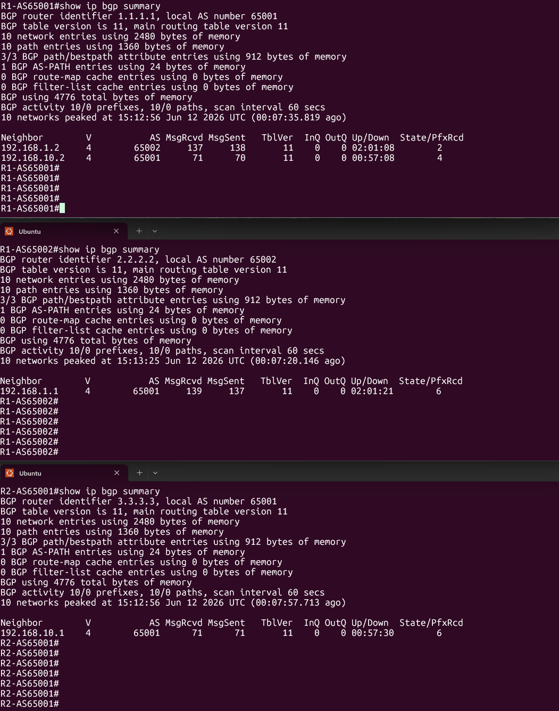
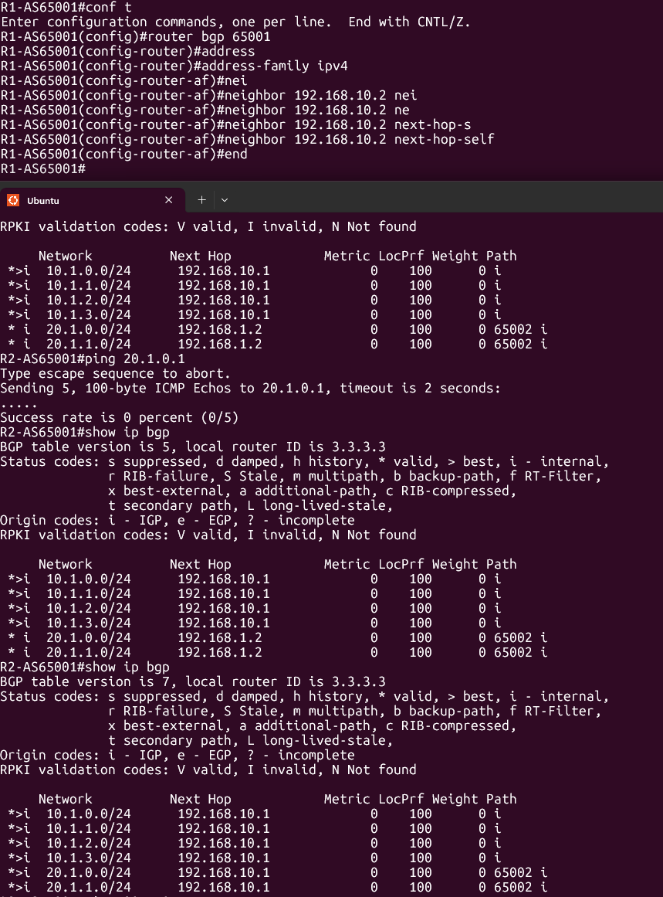
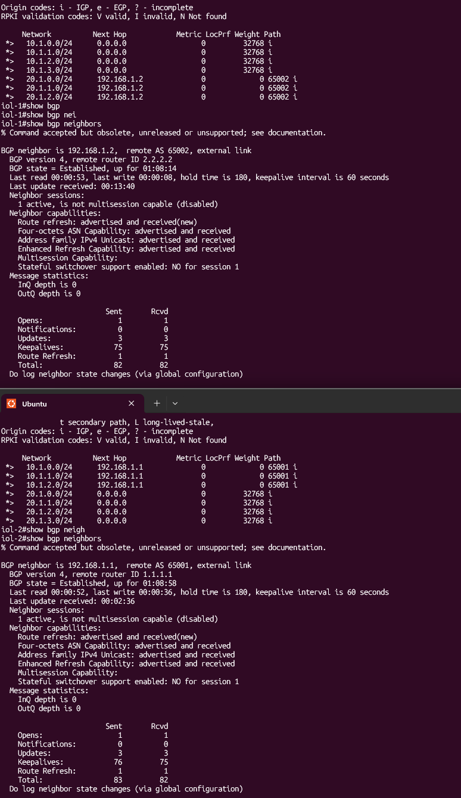
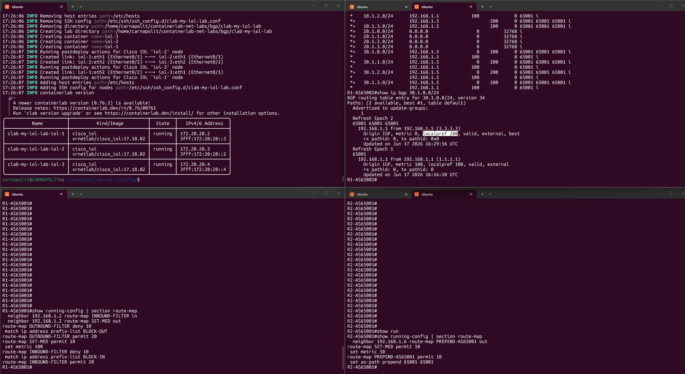

# BGP Lab

A [containerlab](https://containerlab.dev/) topology with 3 Cisco IOL routers demonstrating eBGP/iBGP peering, the iBGP next-hop problem, inbound/outbound prefix filtering, and BGP best-path manipulation via MED, AS-Path prepending and Local Preference.

## Topology

```
        AS 65001                          AS 65002
   ┌───────────────────┐              ┌────────────────┐
   │   R1-AS65001       │  eBGP        │   R1-AS65002    │
   │   (iol-1)           │◄────────────►│   (iol-2)        │
   │   RID 1.1.1.1        │ 192.168.1.0/30 │   RID 2.2.2.2 │
   └─────────┬───────────┘  (dot1Q 10)   └────┬───────────┘
             │ iBGP                            │
             │ 192.168.10.0/30                  │ eBGP
             │                                  │ 192.168.1.4/30
   ┌─────────┴───────────┐                      │
   │   R2-AS65001         │◄─────────────────────┘
   │   (iol-3)             │
   │   RID 3.3.3.3          │
   └────────────────────────┘
```

AS 65001 has two routers (R1, R2) in iBGP with each other, and both peer eBGP directly with the single AS 65002 router. This gives AS65002 two redundant eBGP paths into AS65001 (and vice versa), which is what the path-selection section exploits.

| Config file | Node | AS | Router-ID | Mgmt IP |
|---|---|---|---|---|
| `R1-AS65001.cfg` | iol-1 | 65001 | 1.1.1.1 | 172.20.20.2 |
| `R1-AS65002.cfg` | iol-2 | 65002 | 2.2.2.2 | 172.20.20.3 |
| `R2-AS65001.cfg` | iol-3 | 65001 | 3.3.3.3 | 172.20.20.4 |

> **Legend**: screenshots below show containerlab node names rather than hostnames — `iol-1` = R1-AS65001, `iol-2` = R1-AS65002, `iol-3` = R2-AS65001.

Each router originates 4 loopback /24s into BGP via `network` statements: R1-AS65001 → 10.1.0-3.0/24, R1-AS65002 → 20.1.0-3.0/24, R2-AS65001 → 30.1.0-3.0/24. The base BGP peering config (identical shape on all 3 routers) is:

```
! R1-AS65001
router bgp 65001
 bgp router-id 1.1.1.1
 neighbor 192.168.1.2 remote-as 65002
 neighbor 192.168.10.2 remote-as 65001
 !
 address-family ipv4
  network 10.1.0.0 mask 255.255.255.0
  network 10.1.1.0 mask 255.255.255.0
  network 10.1.2.0 mask 255.255.255.0
  network 10.1.3.0 mask 255.255.255.0
  neighbor 192.168.1.2 activate
  neighbor 192.168.10.2 activate
 exit-address-family
```

With this in place, all 3 routers form full BGP adjacencies and exchange routes as expected:



## iBGP next-hop problem

By default iBGP doesn't rewrite the next-hop of eBGP-learned routes. R1-AS65001 learns 20.1.0.0/24-20.1.3.0/24 from R1-AS65002 with next-hop `192.168.1.2` — a subnet R2-AS65001 has no route to, so those prefixes would be unreachable if passed unchanged over iBGP. Fix applied on R1-AS65001:

```
! R1-AS65001
router bgp 65001
 address-family ipv4
  neighbor 192.168.10.2 activate
  neighbor 192.168.10.2 next-hop-self
 exit-address-family
```

As visible in the following image, the fix restores reachability to the affected prefixes.



## Inbound / outbound prefix filtering

On the R1-AS65001 ↔ R1-AS65002 eBGP session, both sides filter specific prefixes via prefix-lists + route-maps:

- **R1-AS65001**: `INBOUND-FILTER in` drops **20.1.3.0/24** from R1-AS65002.
- **R1-AS65002**: `INBOUND-FILTER in` drops **10.1.3.0/24** from R1-AS65001; `OUTBOUND-FILTER out` withholds **20.1.2.0/24** from being advertised to R1-AS65001.

Config used:

```
! R1-AS65001
ip prefix-list BLOCK-IN seq 5 permit 20.1.3.0/24
!
route-map INBOUND-FILTER deny 10
 match ip address prefix-list BLOCK-IN
route-map INBOUND-FILTER permit 20
!
router bgp 65001
 address-family ipv4
  neighbor 192.168.1.2 route-map INBOUND-FILTER in
```

```
! R1-AS65002
ip prefix-list BLOCK-IN seq 5 permit 10.1.3.0/24
ip prefix-list BLOCK-OUT seq 5 permit 20.1.2.0/24
!
route-map INBOUND-FILTER deny 10
 match ip address prefix-list BLOCK-IN
route-map INBOUND-FILTER permit 20
!
route-map OUTBOUND-FILTER deny 10
 match ip address prefix-list BLOCK-OUT
route-map OUTBOUND-FILTER permit 20
!
router bgp 65002
 address-family ipv4
  neighbor 192.168.1.1 route-map INBOUND-FILTER in
  neighbor 192.168.1.1 route-map OUTBOUND-FILTER out
```

As visible in the following image, the filtered prefixes are indeed missing from the `show ip bgp` table.



## Best-path manipulation

Because R1-AS65002 has two eBGP paths into AS65001, it must run BGP best-path selection between them — the lab walks through each tie-breaker in order.

1. **Router-ID (baseline)** — with all attributes equal (no MED/AS-Path/Local Pref manipulation applied yet), the lower Router-ID wins: R1-AS65001's 1.1.1.1 beats R2-AS65001's 3.3.3.3.

2. **MED** — R1-AS65001 sets MED 100 out towards R1-AS65002; R2-AS65001 was tested with MED 50 (same route-map, later replaced by AS-Path prepending below). Lower MED wins at equal Local Pref/AS-Path.

   ```
   ! R1-AS65001
   route-map SET-MED permit 10
    set metric 100
   !
   router bgp 65001
    address-family ipv4
     neighbor 192.168.1.2 route-map SET-MED out
   ```

3. **AS-Path prepending** — R2-AS65001 prepends AS 65001 twice out towards R1-AS65002, making its path longer so the shorter path via R1-AS65001 is preferred at equal Local Pref.

   ```
   ! R2-AS65001
   route-map PREPEND-AS65001 permit 10
    set as-path prepend 65001 65001
   !
   router bgp 65001
    address-family ipv4
     neighbor 192.168.1.6 route-map PREPEND-AS65001 out
   ```

4. **Local Preference** — R1-AS65002 sets Local Pref 200 inbound from R2-AS65001, which is evaluated *before* AS-Path length, so R2's path wins despite being longer.

   ```
   ! R1-AS65002
   route-map PREFER-R2AS65001 permit 10
    set local-preference 200
   !
   router bgp 65002
    address-family ipv4
     neighbor 192.168.1.5 route-map PREFER-R2AS65001 in
   ```

   The result — R2-AS65001's longer, higher Local Pref path overriding the shorter one — is visible below.

   

> Decision order demonstrated: **Local Preference > AS-Path length > MED > lowest Router-ID**.

## Running the lab

```bash
sudo containerlab deploy -t cisco-iol.clab.yml
sudo containerlab destroy -t cisco-iol.clab.yml
```

Nodes `iol-1`/`iol-2`/`iol-3` are reachable via containerlab console/exec or SSH on 172.20.20.2-4 (user `admin`).
