# EIGRP Lab

A [containerlab](https://containerlab.dev/) topology with 9 Cisco IOL routers running **named-mode EIGRP** (`router eigrp EIGRP-AS100`, `address-family ipv4 unicast autonomous-system 100`), used to practice neighbor formation, the topology table vs. the RIB, wide metrics, ECMP on a shared segment, DUAL (successor / feasible successor / feasibility condition and going Active), stub routing with a leak-map, manual summarization, unequal-cost load balancing with `variance`, and mutual redistribution between two EIGRP autonomous systems.

## Topology

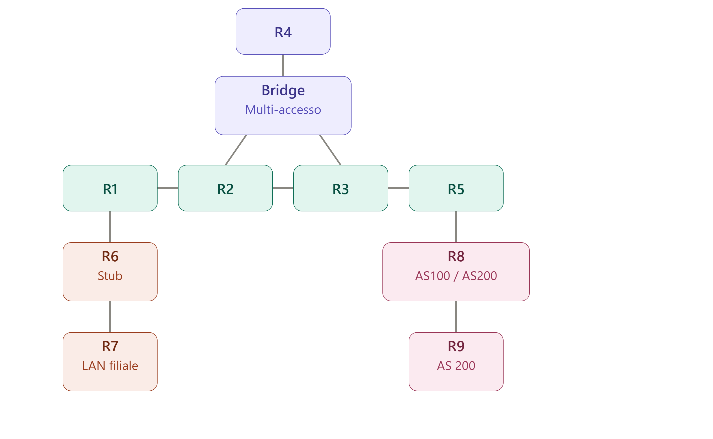

- **Core (AS 100)**: R1 — R2 — R3 — R5, chained by /30 point-to-point links.
- **Multi-access segment**: R2, R3 and R4 share a single broadcast segment (10.0.100.0/24) through a containerlab bridge (`eigrp_br-ma1`). This gives R3 two paths towards R2 (the direct link and the shared segment), which is what makes the ECMP / feasible successor / UCMP sections below possible.
- **Stub branch site**: R1 — R6 — R7. R6 is the branch edge router, configured as an EIGRP stub; R7 is the branch LAN (172.16.100.0/24).
- **Multi-AS boundary**: R5 — R8 — R9. R8 runs two EIGRP processes (AS 100 towards R5, AS 200 towards R9) and redistributes between them; R9 lives only in AS 200.

| Config file | Hostname | Loopback0 (RID) | Other loopbacks | EIGRP AS | Mgmt IP |
|---|---|---|---|---|---|
| `configs/r1.cfg` | R1 | 1.1.1.1 | 172.16.1.1/24, 172.16.2.1/24 | 100 | 172.20.20.10 |
| `configs/r2.cfg` | R2 | 2.2.2.2 | — | 100 | 172.20.20.20 |
| `configs/r3.cfg` | R3 | 3.3.3.3 | — | 100 | 172.20.20.30 |
| `configs/r4.cfg` | R4 | 4.4.4.4 | — | 100 | 172.20.20.40 |
| `configs/r5.cfg` | R5 | 5.5.5.5 | — | 100 | 172.20.20.50 |
| `configs/r6.cfg` | R6 | 6.6.6.6 | — | 100 (stub) | 172.20.20.60 |
| `configs/r7.cfg` | R7 | 7.7.7.7 | 172.16.100.1/24 | 100 | 172.20.20.70 |
| `configs/r8.cfg` | R8 | 8.8.8.8 | — | 100 + 200 | 172.20.20.80 |
| `configs/r9.cfg` | R9 | 9.9.9.9 | 172.16.200.1/24 | 200 | 172.20.20.90 |

| Link | Subnet |
|---|---|
| R1 Et0/1 ↔ R2 Et0/1 | 10.0.12.0/30 |
| R2 Et0/2 ↔ R3 Et0/1 | 10.0.23.0/30 |
| R3 Et0/2 ↔ R5 Et0/1 | 10.0.35.0/30 |
| R2 Et0/3, R3 Et0/3, R4 Et0/1 (bridge) | 10.0.100.0/24 |
| R1 Et0/2 ↔ R6 Et0/1 | 10.0.16.0/30 |
| R6 Et0/2 ↔ R7 Et0/1 | 10.0.67.0/30 |
| R5 Et0/3 ↔ R8 Et0/1 | 10.0.58.0/30 |
| R8 Et0/2 ↔ R9 Et0/1 | 10.0.89.0/30 |

containerlab's `ethN` maps to IOL's `Ethernet0/N`; `Ethernet0/0` is always the management interface (in the `clab-mgmt` VRF).

## Basic named-mode configuration

Every router uses the same pattern: a named EIGRP instance, an IPv4 address family bound to AS 100, an explicit router-id, and one `network` statement per interface with a `0.0.0.0` wildcard (so exactly that interface is enabled, nothing more):

```
! R1
router eigrp EIGRP-AS100
 address-family ipv4 unicast autonomous-system 100
  network 1.1.1.1 0.0.0.0
  network 10.0.12.1 0.0.0.0
  eigrp router-id 1.1.1.1
 exit-address-family
```

With only R1 configured, `show ip eigrp interfaces` shows EIGRP running on Lo0 and Et0/1, but with 0 peers — there's no one on the other side yet:

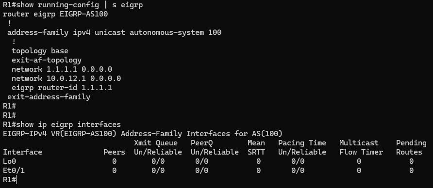

## First neighborship

As soon as R2 is configured, the adjacency comes up on the R1–R2 link: both sides now show 1 peer on Et0/1. R2's Et0/2 and Et0/3 still show 0 peers because R3 and R4 hadn't been configured yet:

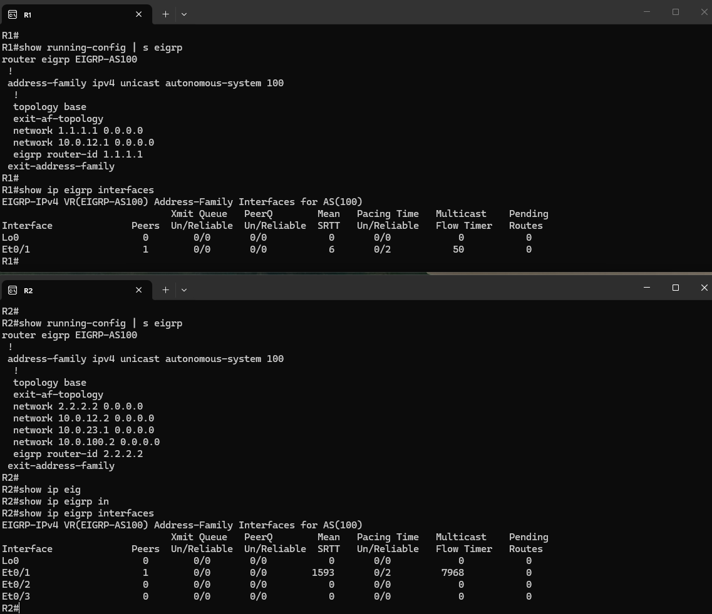

## Topology table vs. routing table — wide metrics

Named mode uses **64-bit wide metrics**, so the values in the topology table are huge (delay is tracked in picoseconds). Each entry shows `(FD/RD)` — the Feasible Distance (total metric from this router) and the Reported Distance (the metric as advertised by the neighbor). The RIB can't hold a 64-bit metric, so the value installed in the routing table is the wide metric divided by the `rib-scale` (128 by default):

```
show ip eigrp topology  ->  2.2.2.2/32  FD 131153920
show ip route eigrp     ->  2.2.2.2     [90/1024640]     (131153920 / 128 = 1024640)
```

On R1, every remote prefix is reached via R2 (10.0.12.2), with the metric increasing as prefixes get farther away:

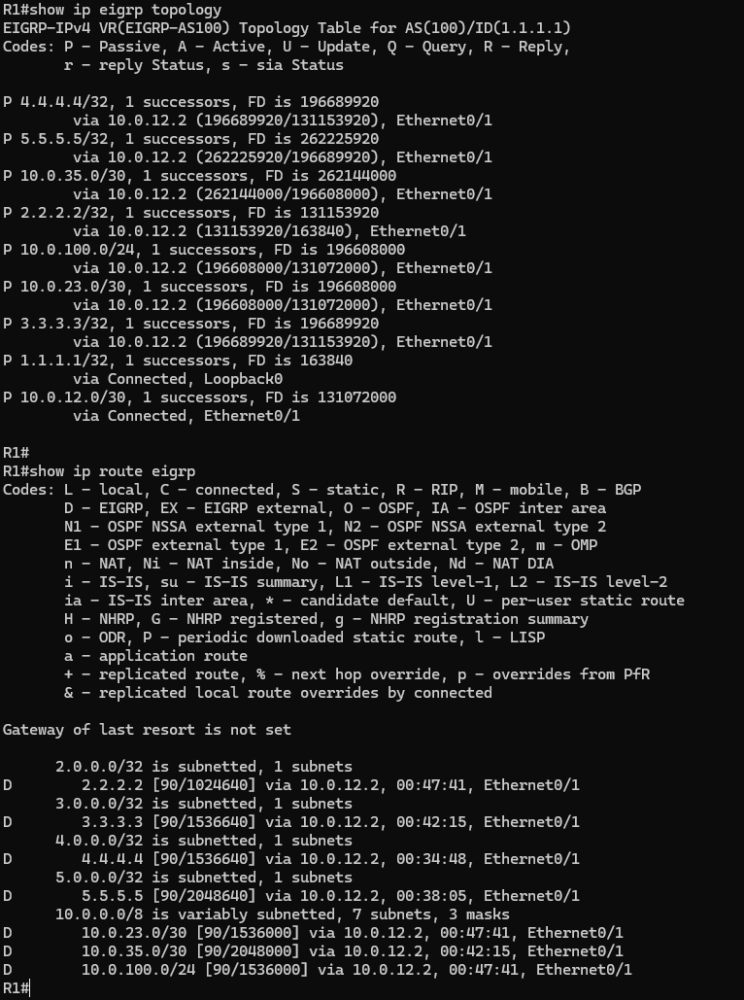

## Multi-access segment and ECMP

R4 sits only on the shared 10.0.100.0/24 segment and forms two adjacencies over the same interface (Et0/1), one with R2 and one with R3 — EIGRP has no DR/BDR concept, so every router on the segment peers with every other one.

Since R2 and R3 are equally far from 10.0.23.0/30 (the link between them), R4 installs **2 successors** for it — equal-cost multipath, with identical FD and RD through both neighbors:

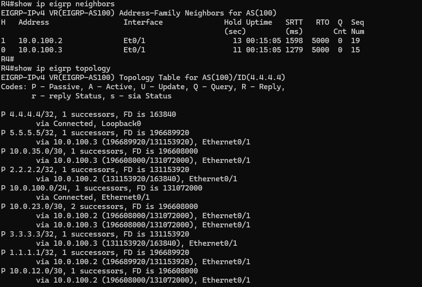

## From ECMP to feasible successor

R3 initially also had two equal-cost successors for R2's loopback 2.2.2.2/32: the direct link (Et0/1) and the shared segment (Et0/3). Raising the delay on R3's Et0/3 breaks the tie:

```
R3(config)#interface Ethernet0/3
R3(config-if)# delay 1000
```

(`delay` is in tens of microseconds, so 1000 = 10 ms.) The path via Et0/3 now has a much worse composite metric (720977920 vs. 131153920), so it is no longer a successor. It is, however, a **feasible successor**: its Reported Distance (163840, R2's own cost to its loopback) is lower than the current Feasible Distance (131153920), so the **feasibility condition** is met — the path is guaranteed loop-free and stays in the topology table as a pre-computed backup that can be used immediately if the successor fails, without going Active:

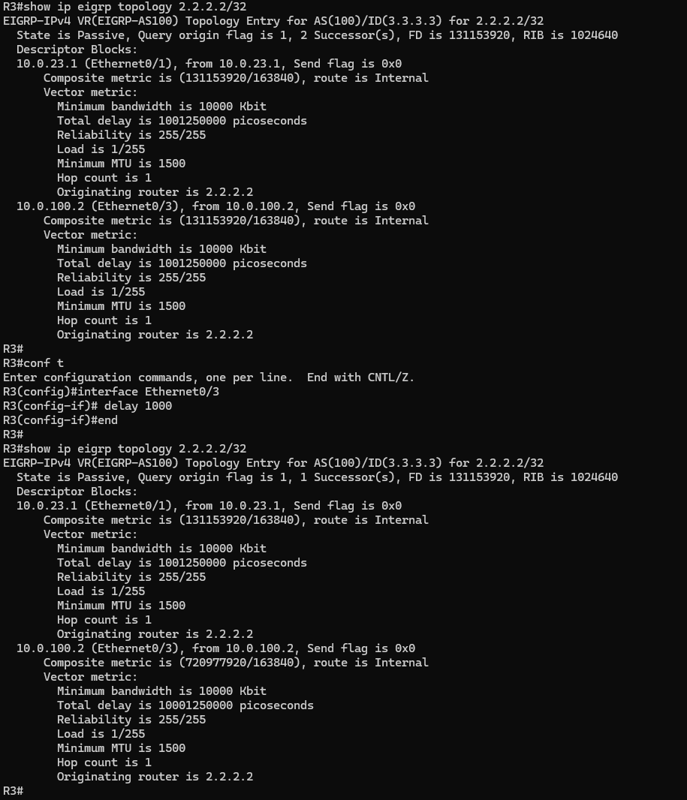

A side effect visible later in the lab: every prefix R3 reaches or advertises through Et0/3 now carries the extra delay — e.g. R5 sees 10.0.100.0/24 with a metric of 6144000.

## DUAL — losing a route with no feasible successor

To see the opposite case, the R3–R5 link was shut down (R3 Et0/2) with EIGRP debugging enabled on R3. For 5.5.5.5/32 and 10.0.35.0/30, R3 had only one path (through R5) and **no feasible successor**, so DUAL can't switch over locally:

1. the neighbor goes down (`%DUAL-5-NBRCHANGE ... Neighbor 10.0.35.2 (Ethernet0/2) is down`);
2. `Find FS ... not found` — the routes enter the **Active** state;
3. R3 sends **QUERY** packets out of Et0/1 (to R2) and Et0/3 (to R2 and R4 on the shared segment);
4. every neighbor answers with a **REPLY** carrying an infinite metric (72057594037927935) — none of them has an alternative path that doesn't go through R3;
5. once all replies are in (`reply count` reaches 0), DUAL concludes there is no route left: `No routes. Flushing dest 10.0.35.0/30` / `5.5.5.5/32`.

The debug also shows R3 itself answering the queries from its neighbors, and the poison-reverse updates (`Ignored Route ... Duplicate Router ID ... Poison`).

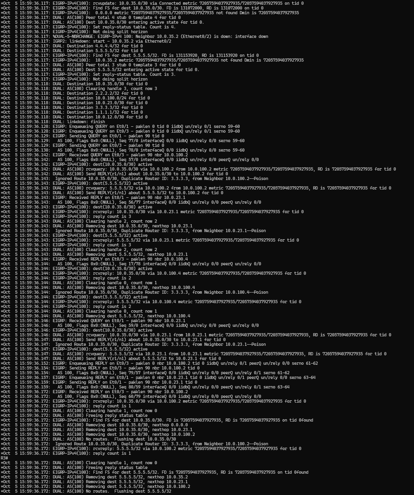

## Stub routing on R6

The R6/R7 branch hangs off R1 with a single uplink, so there's no reason for the core to ever query it or use it as transit. Before any stub configuration, R6 advertises everything it knows, including what it learned from R7 — R5, at the other end of the network, sees 6.6.6.6, 7.7.7.7, 10.0.16.0/30, 10.0.67.0/30 and the branch LAN 172.16.100.0/24:

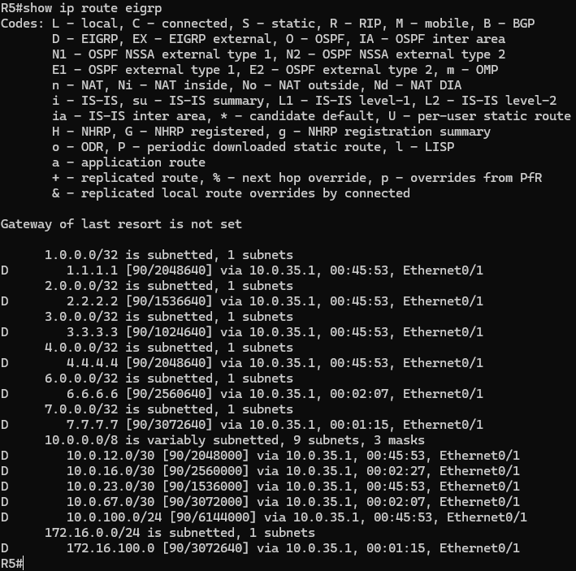

Configuring R6 as a stub (`eigrp stub` defaults to `connected summary`) tells its neighbors not to send it queries — limiting the query scope when something fails in the core — and makes R6 advertise only its connected and summary routes. The side effect is that R6 stops re-advertising the routes it learned from R7: on R5, 7.7.7.7/32 and 172.16.100.0/24 disappear, while R6's connected networks (6.6.6.6, 10.0.16.0/30, 10.0.67.0/30) are still there:

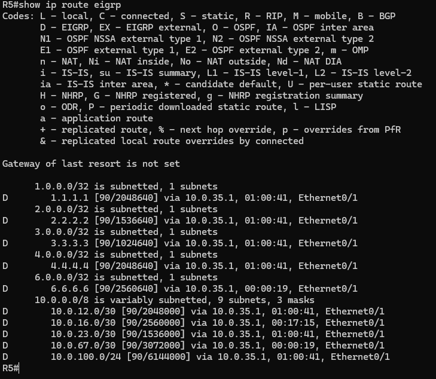

### Leaking the branch LAN with a leak-map

A **leak-map** lets a stub router advertise selected learned routes anyway. A prefix-list matches R7's loopback and LAN, a route-map references it, and the route-map is attached to the stub statement:

```
! R6
ip prefix-list BRANCH-LAN seq 5 permit 172.16.100.0/24
ip prefix-list BRANCH-LAN seq 10 permit 7.7.7.7/32
!
route-map LEAK-BRANCH permit 10
 match ip address prefix-list BRANCH-LAN
!
router eigrp EIGRP-AS100
 address-family ipv4 unicast autonomous-system 100
  eigrp stub connected summary leak-map LEAK-BRANCH
```

R6 keeps its stub role (still not queried), but 7.7.7.7/32 and 172.16.100.0/24 are back in R5's routing table:

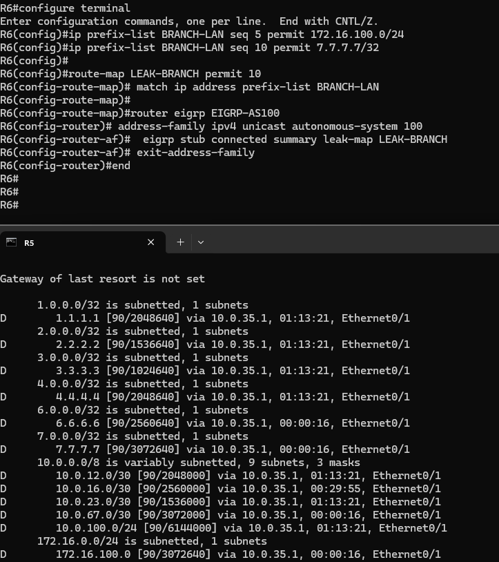

## Manual summarization on R1

Two extra loopbacks on R1 (172.16.1.0/24 and 172.16.2.0/24) give something to summarize. In named mode the summary is configured per interface, under `af-interface`, here only towards the core (Et0/1, the link to R2):

```
! R1
router eigrp EIGRP-AS100
 address-family ipv4 unicast autonomous-system 100
  af-interface Ethernet0/1
   summary-address 172.16.0.0 255.255.252.0
  exit-af-interface
  network 172.16.1.1 0.0.0.0
  network 172.16.2.1 0.0.0.0
```

Beyond R2, the core only sees the single 172.16.0.0/22 summary — on R5 it shows up as `D 172.16.0.0/22` instead of the two /24s:

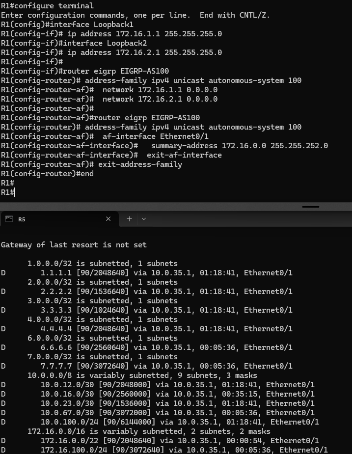

On R1 itself, EIGRP automatically installs a **discard route** for the summary (`172.16.0.0/22 is a summary, Null0`), so traffic for unused addresses inside the /22 gets dropped instead of looping. Since the summary is applied only on Et0/1, R6 (reached via Et0/2) still receives the specific 172.16.1.0/24 and 172.16.2.0/24 routes:

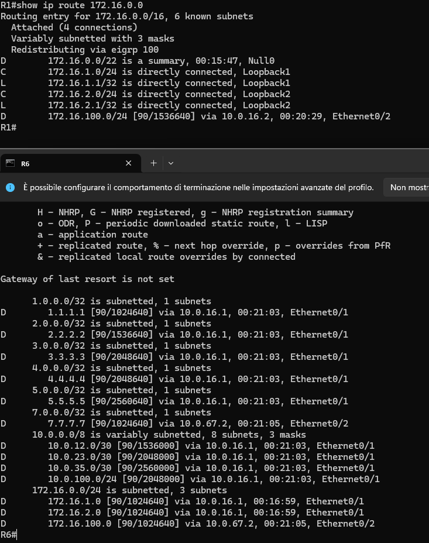

## Unequal-cost load balancing with `variance`

Thanks to the delay added earlier, R3 has one successor (via Et0/1) and one feasible successor (via Et0/3) for 2.2.2.2/32. By default EIGRP only installs equal-cost paths; `variance N` also installs any **feasible successor** whose metric is less than N times the FD. Only feasible successors qualify — the feasibility condition still guarantees no loops.

The ratio between the two paths is 720977920 / 131153920 ≈ 5.5, so:

- with `variance 5` the second path is still out (5 × FD < its metric) — the RIB still holds just one path;
- with `variance 6` both paths are installed, with traffic shared proportionally to the metrics (**traffic share count 60 vs. 11**, i.e. roughly 5.5:1 in favour of the better path).

```
! R3
router eigrp EIGRP-AS100
 address-family ipv4 unicast autonomous-system 100
  topology base
   variance 6
```

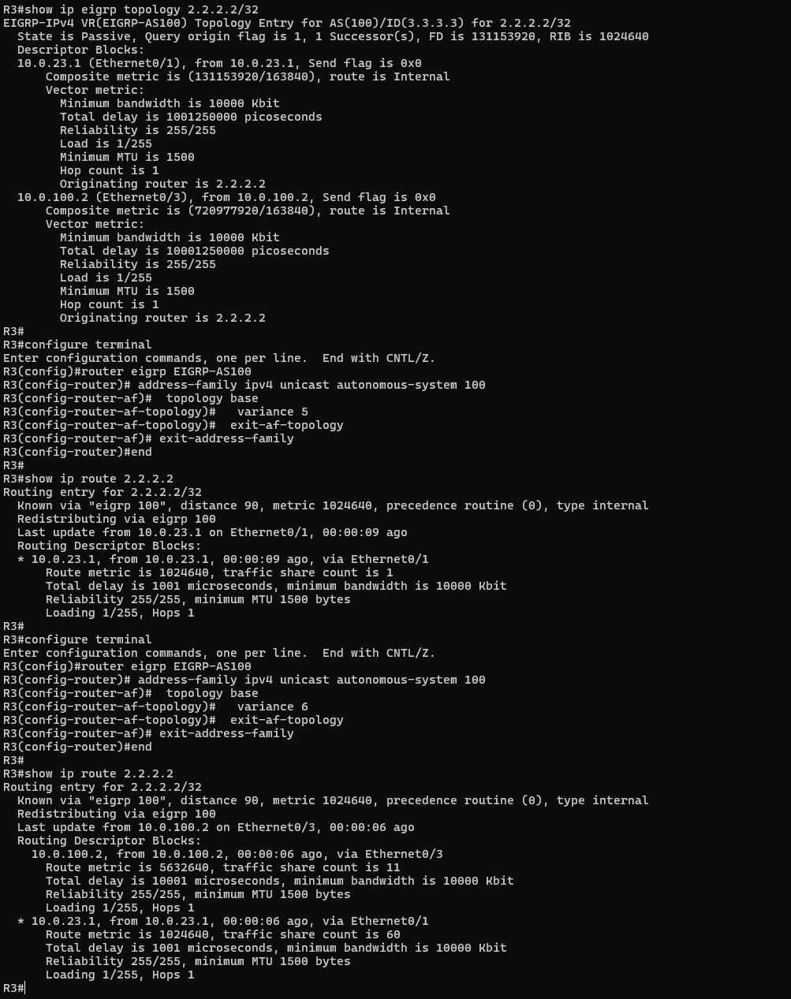

## Multiple EIGRP processes and redistribution on R8

R8 runs two separate EIGRP instances: `EIGRP-AS100` (peering with R5 on Et0/1) and `EIGRP-AS200` (peering with R9 on Et0/2). R8 itself has a neighbor in each AS and learns routes from both sides, so its routing table contains the whole AS 100 network plus 9.9.9.9 and 172.16.200.0/24 from AS 200:

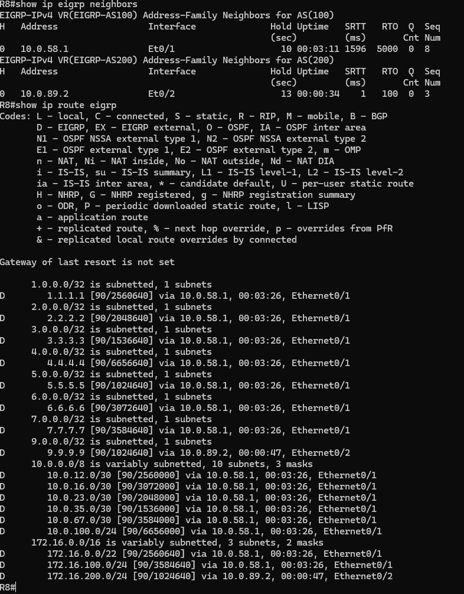

But two different EIGRP ASes don't exchange routes on their own — R8 doesn't pass anything from one process to the other, so R5 and R9 can't reach each other's loopbacks:

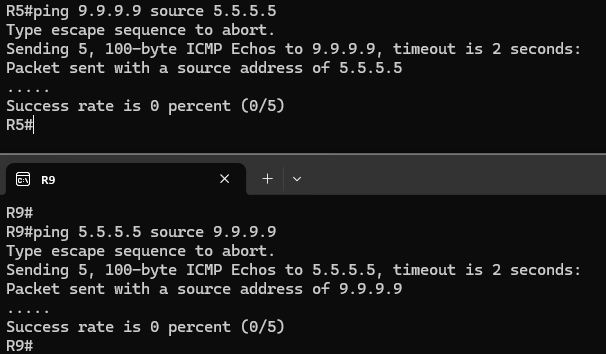

Mutual redistribution on R8 fixes it (in named mode, `redistribute` goes under `topology base`; no seed metric is needed between two EIGRP processes, since the original metric is carried over). The routes appear on the other side as EIGRP external routes (`D EX`, AD 170):

```
! R8
router eigrp EIGRP-AS100
 address-family ipv4 unicast autonomous-system 100
  topology base
   redistribute eigrp 200
!
router eigrp EIGRP-AS200
 address-family ipv4 unicast autonomous-system 200
  topology base
   redistribute eigrp 100
```

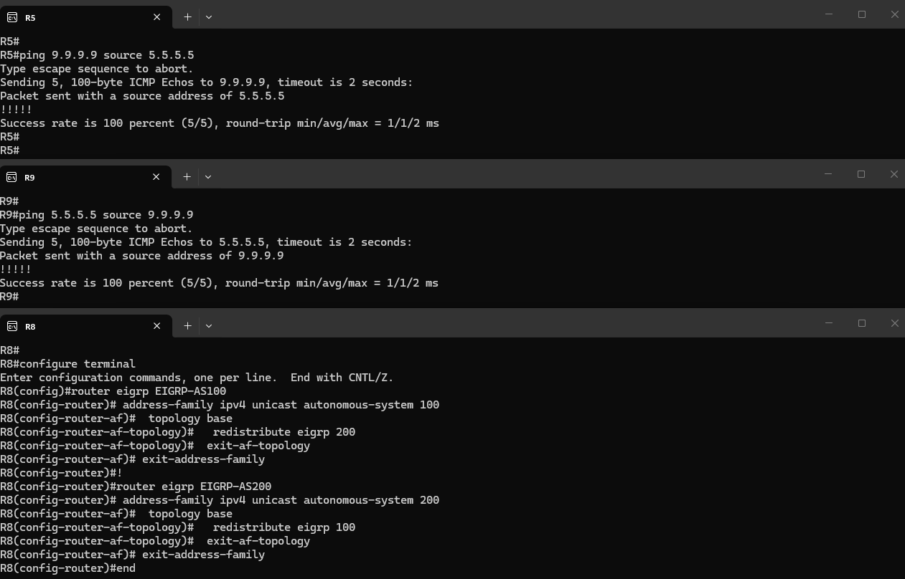

### Route tagging to prevent redistribution loops

The final config in `configs/r8.cfg` refines the redistribution with route-maps that **tag** routes on their way into each AS and **deny** routes already carrying the other AS's tag — so a prefix can never be redistributed back into the AS it came from. With a single redistribution point this is mostly a safeguard, but it's the standard pattern as soon as there's more than one boundary router:

```
! R8
route-map AS200-TO-AS100 deny 10
 match tag 100
route-map AS200-TO-AS100 permit 20
 set tag 200
!
route-map AS100-TO-AS200 deny 10
 match tag 200
route-map AS100-TO-AS200 permit 20
 set tag 100
!
router eigrp EIGRP-AS100
 address-family ipv4 unicast autonomous-system 100
  topology base
   redistribute eigrp 200 route-map AS200-TO-AS100
!
router eigrp EIGRP-AS200
 address-family ipv4 unicast autonomous-system 200
  topology base
   redistribute eigrp 100 route-map AS100-TO-AS200
```

## Running the lab

```bash
# create the multi-access bridge if missing (it's a host bridge, so it must exist before deploy)
./scripts/create_bridge.sh eigrp_br-ma1

# deploy / destroy
sudo containerlab deploy -t eigrp/eigrp.clab.yml
sudo containerlab destroy -t eigrp/eigrp.clab.yml --cleanup
```

Nodes `r1`–`r9` are reachable via containerlab console/exec or SSH on 172.20.20.10–90 (user `admin`). `scripts/lab_tools.py` can export the running configs back into `configs/` (`export-configs`) and open an SSH session to every router at once (`open-sessions`).
