# OSPF Lab

A [containerlab](https://containerlab.dev/) topology with 8 Cisco IOL routers running single-process OSPFv2 (`router ospf 1`) across 4 areas, used to practice multi-area design, DR/BDR election (both by arrival order and forced deterministically via priority) on a shared segment, the point-to-point network type, NSSA default-route origination with Type-7/Type-5 translation, totally stubby areas, inter-area (IA) route propagation through ABRs, and the effect of `passive-interface`.

## Topology

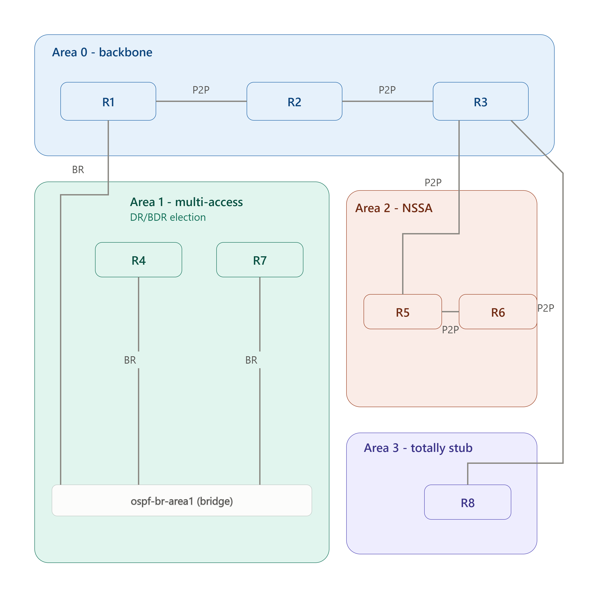

- **Area 0 (backbone)**: R1 — R2 — R3, chained by point-to-point links.
- **Area 1 (multi-access)**: R1, R4, R7 share a single broadcast segment via a containerlab bridge (`ospf-br-area1`), triggering DR/BDR election.
- **Area 2 (NSSA)**: R3 — R5 — R6, chained by point-to-point links, configured as a Not-So-Stubby Area (`area 2 nssa`). R6 redistributes static routes — including a default — into the NSSA as Type-7 LSAs.
- **Area 3 (totally stubby)**: R3 — R8, a single point-to-point link, configured as a totally stubby area (`area 3 stub no-summary` on the ABR). R8 only ever sees one injected default route.
- **R1** and **R3** are the two Area Border Routers (ABRs). R1 sits between Area 0 and Area 1; R3 sits between Area 0 and both Area 2 and Area 3.

| Config file | Hostname | Loopback0 (RID) | Area(s) | Mgmt IP |
|---|---|---|---|---|
| `configs/r1.cfg` | r1 | 1.1.1.1 | 0, 1 (ABR) | 172.20.20.10 |
| `configs/r2.cfg` | R2 | 2.2.2.2 | 0 | 172.20.20.20 |
| `configs/r3.cfg` | R3 | 3.3.3.3 | 0, 2, 3 (ABR) | 172.20.20.30 |
| `configs/r4.cfg` | R4 | 4.4.4.4 | 1 | 172.20.20.40 |
| `configs/r5.cfg` | R5 | 5.5.5.5 | 2 | 172.20.20.50 |
| `configs/r6.cfg` | R6 | 6.6.6.6 | 2 | 172.20.20.60 |
| `configs/r7.cfg` | R7 | 7.7.7.7 | 1 | 172.20.20.70 |
| `configs/r8.cfg` | r8 | 8.8.8.8 | 3 | 172.20.20.80 |

Every node advertises its Loopback0 into OSPF, so the router-id matches the loopback address shown above — confirmed with `show ip ospf` on r1:

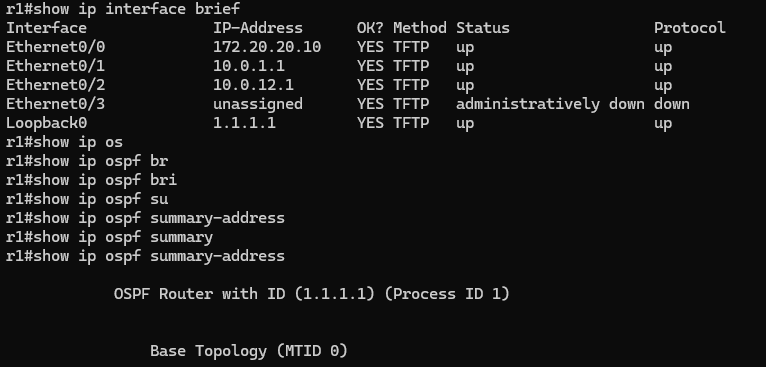

Before touching OSPF at all, base L3 addressing was verified on all 7 nodes with `show ip interface brief`:

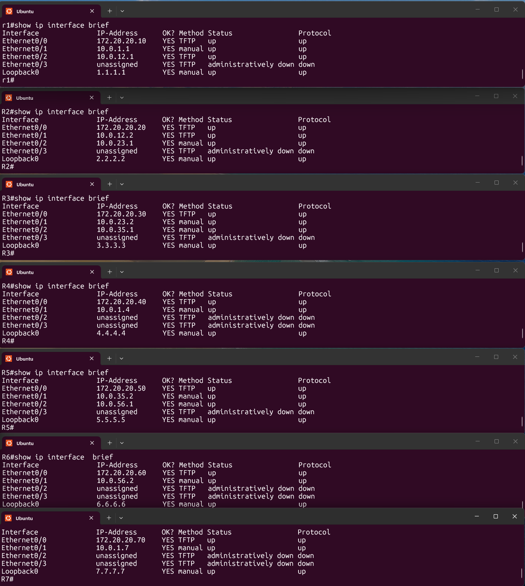

## Area 0 — backbone

R1, R2 and R3 form the backbone over three /30 point-to-point links:

| Link | Subnet |
|---|---|
| R1 Et0/2 ↔ R2 Et0/1 | 10.0.12.0/30 |
| R2 Et0/2 ↔ R3 Et0/1 | 10.0.23.0/30 |

Base config (R2, a pure Area 0 router with no ABR role):

```
! R2
interface Loopback0
 ip address 2.2.2.2 255.255.255.255
interface Ethernet0/1
 ip address 10.0.12.2 255.255.255.252
 ip ospf network point-to-point
interface Ethernet0/2
 ip address 10.0.23.1 255.255.255.252
 ip ospf network point-to-point
!
router ospf 1
 network 2.2.2.2 0.0.0.0 area 0
 network 10.0.12.0 0.0.0.3 area 0
 network 10.0.23.0 0.0.0.3 area 0
```

## Area 1 — multi-access segment and DR/BDR election

R1, R4 and R7 all connect to `ospf-br-area1`, a shared Linux bridge acting as a single broadcast (multi-access) segment on 10.0.1.0/24 — the one part of the topology where OSPF's default broadcast network type applies and a DR/BDR election is actually needed:

```
! R1 (also ABR for area 0/1)
interface Ethernet0/1
 ip address 10.0.1.1 255.255.255.0
!
router ospf 1
 network 1.1.1.1 0.0.0.0 area 0
 network 10.0.1.0 0.0.0.255 area 1
 network 10.0.12.0 0.0.0.3 area 0
```

R1 won the election and became DR, R4 became BDR, and R7 stayed DROTHER — note this is a consequence of **arrival order**, not router-id (R7's RID 7.7.7.7 is numerically highest but it came up after R1 had already declared itself DR):

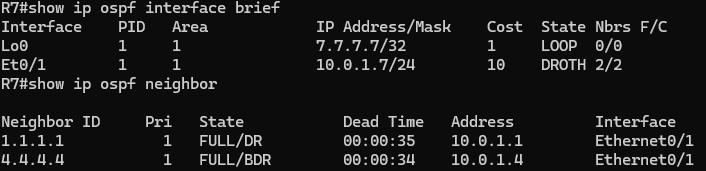

Right after OSPF was first enabled everywhere (still with the default broadcast network type on every link, before point-to-point was applied to the Area 0/Area 2 links below), `show ip ospf interface brief` was captured on all 7 routers just to confirm the process was up and adjacencies had formed:

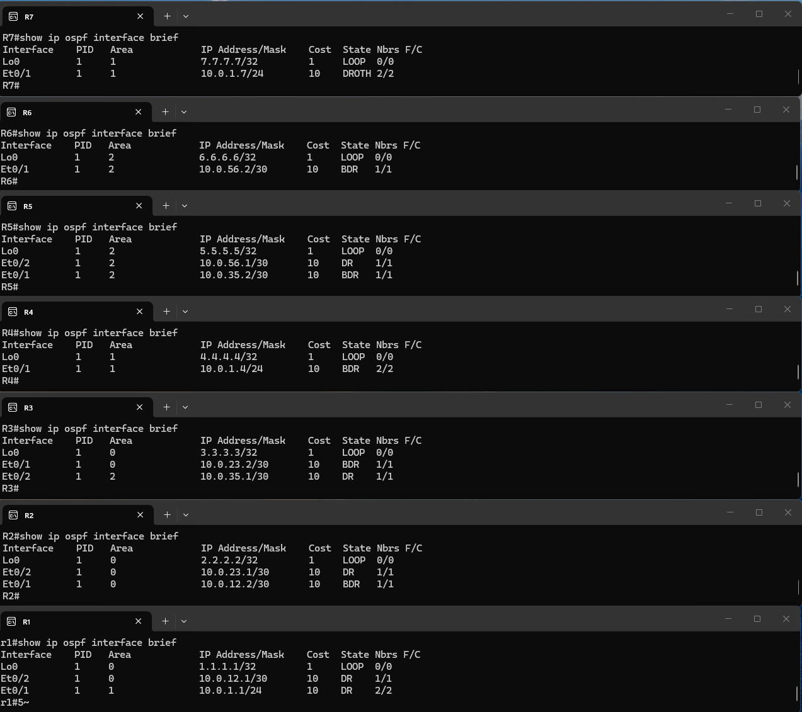

### Forcing a deterministic election with `ip ospf priority`

Relying on arrival order to decide the DR is fragile — a reload or a manual reset can reshuffle the result. To make the outcome deterministic and put R1 in control regardless of boot order, `ip ospf priority 2` was applied on R1's Et0/1 (the OSPF default priority is 1, so R1 now outranks every other router on the segment):

```
r1(config)#interface Ethernet0/1
r1(config-if)# ip ospf priority 2
```

After forcing a fresh election with `clear ip ospf process`, R1 (priority 2) wins DR outright, overriding whatever arrival order would otherwise have produced:


## Passive interface

To see the effect of `passive-interface` on a broadcast segment, R7's Et0/1 was made passive on the live router (not persisted to `r7.cfg`). A passive interface still gets advertised into OSPF, but stops sending/receiving Hello packets, so existing adjacencies on it age out. From R1's side, `debug ip ospf hello` shows R7's Hellos stop arriving and, once the dead timer expires, the adjacency drops from FULL to DOWN; R7's side shows the `passive-interface` command being applied under `router ospf 1`:

```
R7(config)#router ospf 1
R7(config-router)#passive-interface Ethernet0/1
```

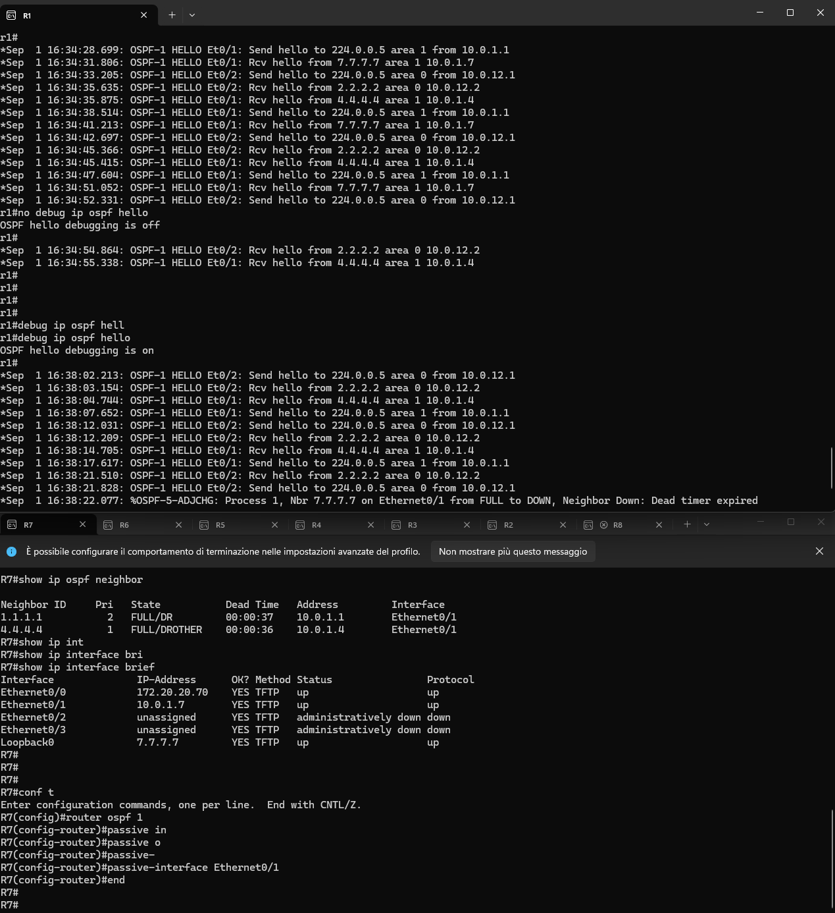

## Area 2 — NSSA

R3 — R5 — R6 form a second point-to-point chain off R3, on 10.0.35.0/30 and 10.0.56.0/30, configured as a Not-So-Stubby Area (`area 2 nssa` on R3 and R5). An NSSA still blocks regular Type-5 AS-external LSAs from crossing into it from the backbone, but lets a router inside the area inject external routes as Type-7 LSAs — which the ABR (R3) then translates into Type-5 LSAs for the rest of the OSPF domain.

### Redistributing a static route into the NSSA

R6 redistributes a static test route (192.168.99.0/24 to Null0) into OSPF:

```
! R6
ip route 192.168.99.0 255.255.255.0 Null0
!
router ospf 1
 area 2 nssa
 redistribute static
 network 6.6.6.6 0.0.0.0 area 2
 network 10.0.56.0 0.0.0.3 area 2
```

`show ip ospf database nssa-external` on R6 confirms the route is originated as a Type-7 LSA, local to the NSSA:

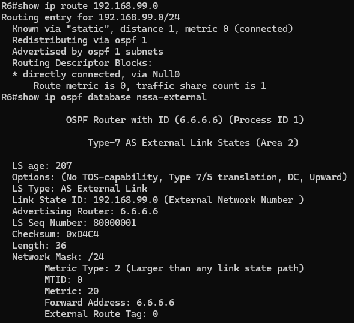

R3, the ABR, translates it into a Type-5 AS-external LSA:

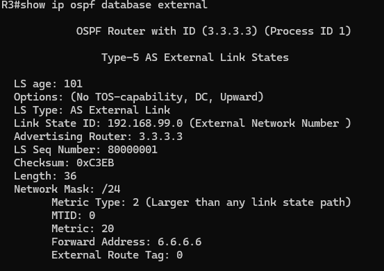

...and the route reaches routers outside the NSSA — like R4, in Area 1 — as a regular `O E2` external route:

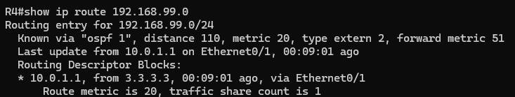

### Originating a default route from inside the NSSA

Normally only the NSSA ABR auto-generates a default route into the area. To originate one from R6 instead — a non-ABR NSSA router — it needs a static default to Null0 plus `redistribute static` and `area 2 nssa default-information-originate` together with `default-information originate`:

```
! R6
ip route 0.0.0.0 0.0.0.0 Null0
!
router ospf 1
 area 2 nssa default-information-originate
 redistribute static
 default-information originate
```

`show ip ospf database nssa-external` on R6 now lists two Type-7 LSAs — the default (0.0.0.0/0) alongside the earlier test route:

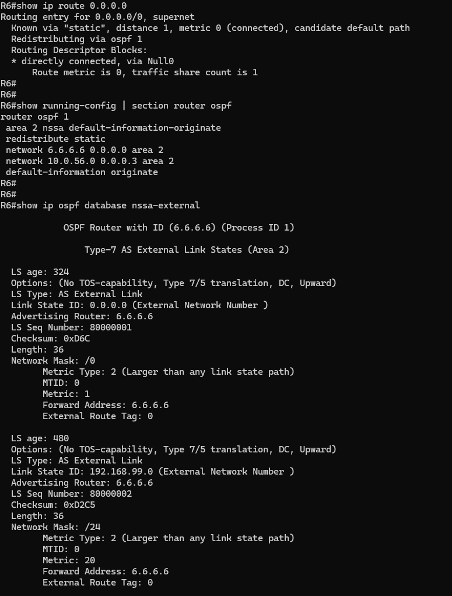

R3 receives the NSSA default as an `O*IA` route of type "NSSA extern 2", and translates it — together with the other route — into Type-5 LSAs for the backbone:

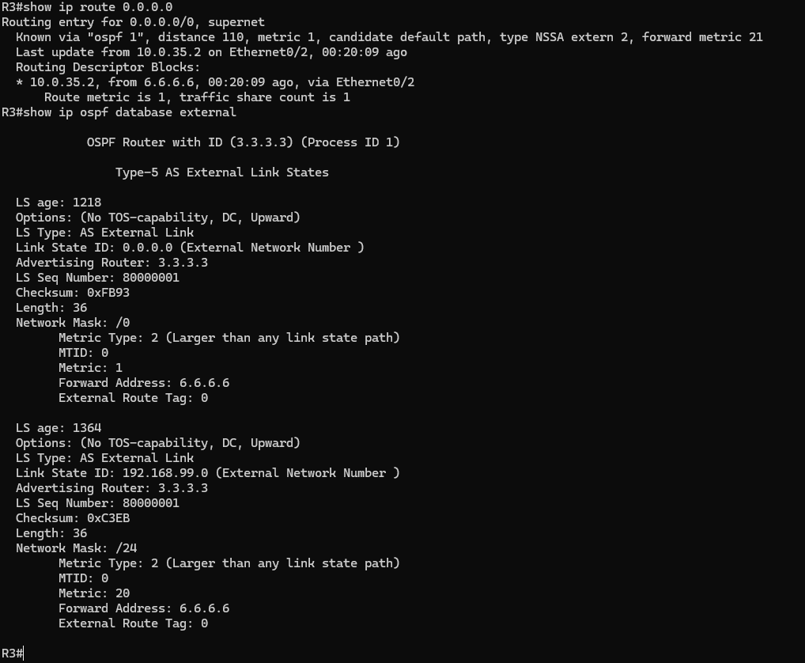

## Area 3 — totally stubby area

R3 and R8 connect over a single point-to-point link on 10.0.38.0/30, with Area 3 configured as totally stubby:

```
! R3 (ABR)
router ospf 1
 area 3 stub no-summary
 network 10.0.38.0 0.0.0.3 area 3

! R8
router ospf 1
 area 3 stub
 network 8.8.8.8 0.0.0.0 area 3
 network 10.0.38.0 0.0.0.3 area 3
```

`no-summary` on the ABR suppresses both inter-area (Type-3) summaries and external (Type-5) routes on top of the plain-stub behavior, replacing all of them with a single injected default. R8's routing table confirms it — the only OSPF route present is the ABR-originated default (`O*IA 0.0.0.0/0` via R3), with no `O IA` entries for any other area's subnets:

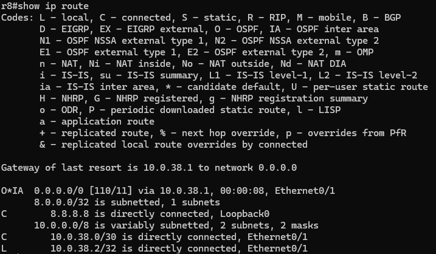

## Point-to-point network type

Every Ethernet link that is logically a point-to-point connection (all Area 0, Area 2 and Area 3 links) has `ip ospf network point-to-point` applied instead of being left as the OSPF default (broadcast), which skips DR/BDR election entirely on those segments — only the genuinely multi-access Area 1 segment still needs one. The effect is shown live on R1's Et0/2 (its link to R2): before the change the interface elects a DR/BDR like any broadcast segment (R1 itself DR, neighbor 2.2.2.2 FULL/BDR); after `ip ospf network point-to-point` is applied, the interface state flips to `P2P` and the neighbor relationship drops the DR/BDR role entirely (`FULL/-`):

```
r1(config)#interface Ethernet0/2
r1(config-if)# ip ospf network point-to-point
```

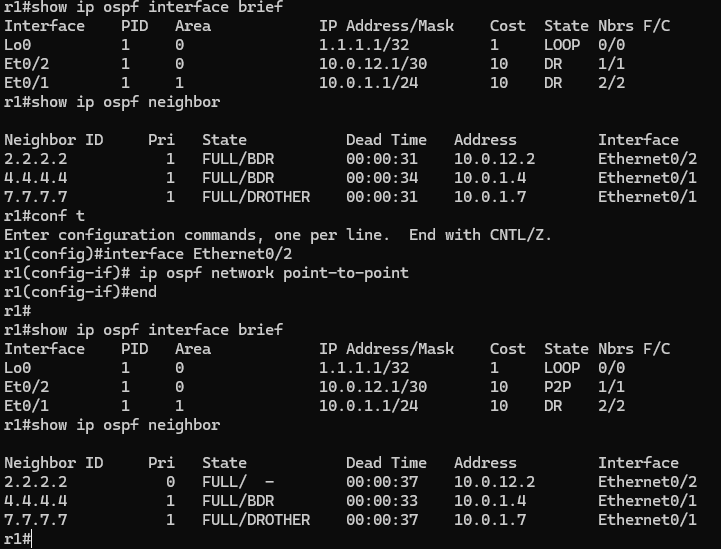

Applying this consistently across every Area 0/Area 2 link, `show ip ospf interface brief` on all 7 routers confirms the expected final states — `LOOP` on loopbacks, `P2P` (no DR/BDR) on every backbone/area 2 link, and DR/BDR/DROTHER only on the Area 1 broadcast segment (a later, simultaneous re-election here also handed the DR role to R7, the highest router-id, instead of R1 — before priority was used to pin the result deterministically, see [above](#forcing-a-deterministic-election-with-ip-ospf-priority)):

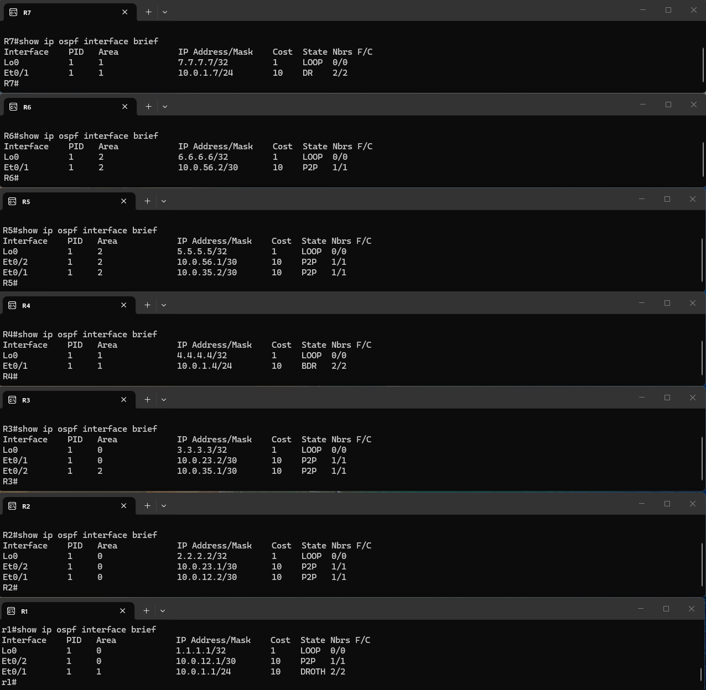

## ABR behavior and inter-area routes

`show ip protocols` on R1 confirms it is an area border router serving 2 areas (0 and 1):

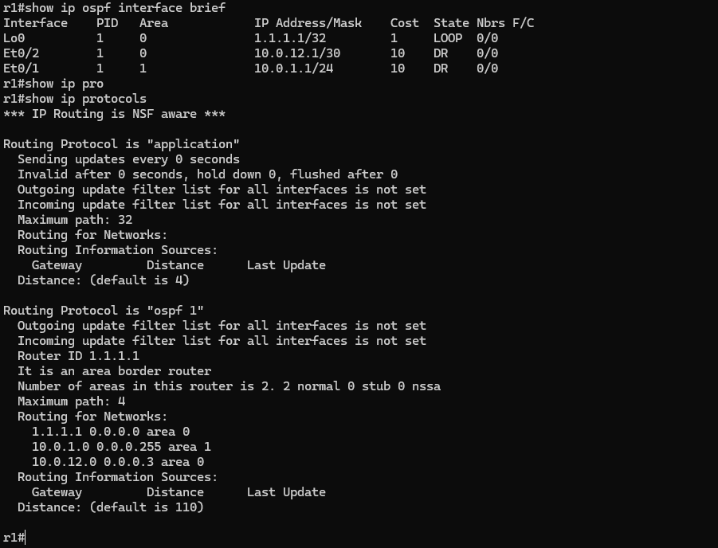

Because R3 is the ABR for Area 2 (and, since Area 3 was added, for Area 3 too), prefixes originating there (5.5.5.5, 6.6.6.6, 10.0.35.0/30, 10.0.56.0/30) show up on R1 as `O IA` (inter-area) routes via R3, while Area 0-local prefixes (2.2.2.2, 3.3.3.3) show up as plain `O`:

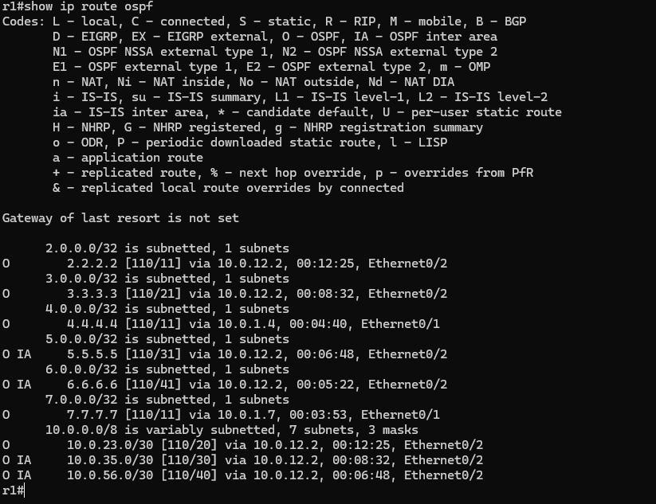

## Running the lab

```bash
# from scripts/, creates the ospf-br-area1 bridge if missing, then deploys
./scripts/deploy.sh

# or directly
sudo containerlab deploy -t cisco-iol.clab.yml
sudo containerlab destroy -t cisco-iol.clab.yml --cleanup
```

Nodes `r1`–`r8` are reachable via containerlab console/exec or SSH on 172.20.20.10–80 (user `admin`). `scripts/open_sessions.sh` opens an SSH session to all 8 routers at once, each in its own Windows Terminal tab (run from WSL).
