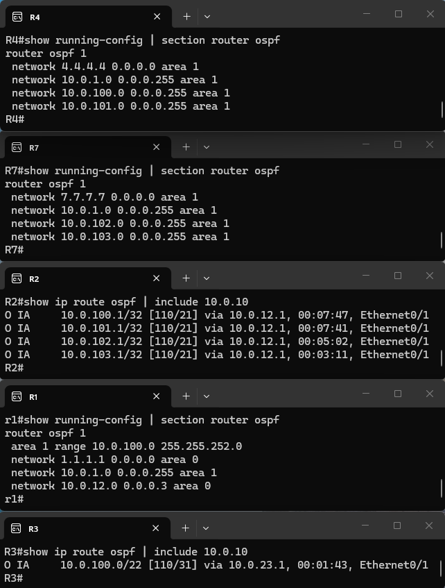
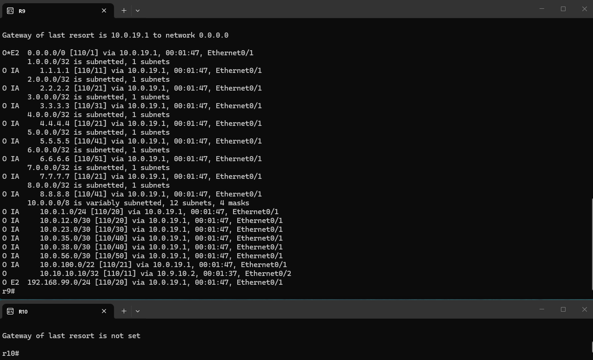
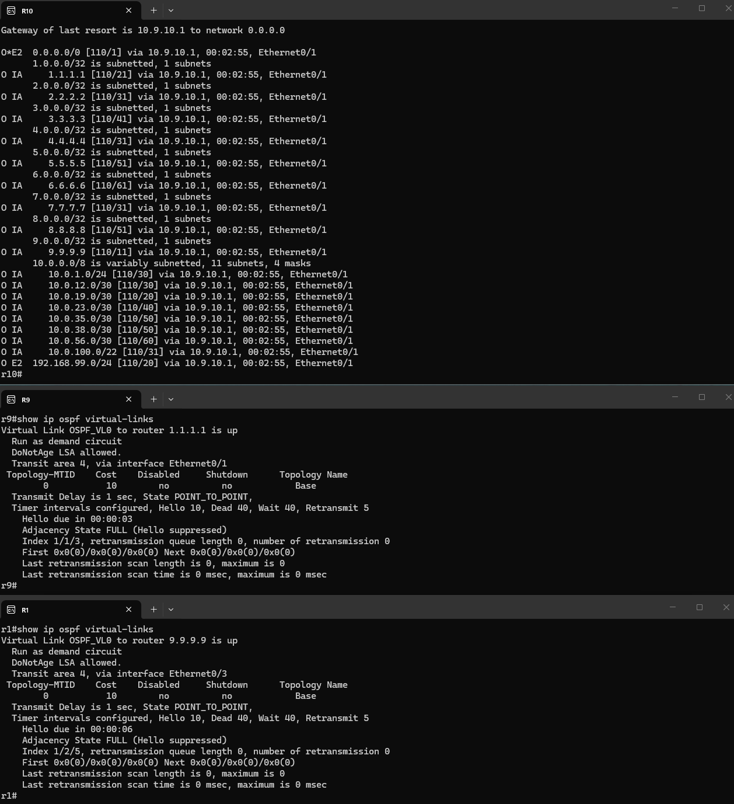

# OSPF Lab

A [containerlab](https://containerlab.dev/) topology with 10 Cisco IOL routers running single-process OSPFv2 (`router ospf 1`) across 6 areas, used to practice multi-area design, DR/BDR election (both by arrival order and forced deterministically via priority) on a shared segment, the point-to-point network type, NSSA default-route origination with Type-7/Type-5 translation, totally stubby areas, inter-area (IA) route propagation through ABRs, inter-area route summarization on an ABR, a discontiguous (backbone-less) area fixed with a virtual link, and the effect of `passive-interface`.

## Topology


- **Area 0 (backbone)**: R1 — R2 — R3, chained by point-to-point links.
- **Area 1 (multi-access)**: R1, R4, R7 share a single broadcast segment via a containerlab bridge (`ospf-br-area1`), triggering DR/BDR election.
- **Area 2 (NSSA)**: R3 — R5 — R6, chained by point-to-point links, configured as a Not-So-Stubby Area (`area 2 nssa`). R6 redistributes static routes — including a default — into the NSSA as Type-7 LSAs.
- **Area 3 (totally stubby)**: R3 — R8, a single point-to-point link, configured as a totally stubby area (`area 3 stub no-summary` on the ABR). R8 only ever sees one injected default route.
- **Area 4 (normal)**: R1 — R9, a single point-to-point link. An ordinary, non-stub area, added purely as the transit area for the virtual link described below.
- **Area 5 (discontiguous)**: R9 — R10, a single point-to-point link. R9's *other* interface (to R1) sits in Area 4, not Area 0, so R9 has no interface actually in the backbone. Area 5 hangs entirely off that non-backbone-attached ABR, with no path of its own to Area 0 — making it a discontiguous area, fixed with a virtual link (see [below](#area-5--discontiguous-area-and-the-virtual-link)).
- **R1** and **R3** are the two "real" Area Border Routers (ABRs) with a leg physically in Area 0. R1 sits between Area 0, Area 1 and Area 4; R3 sits between Area 0, Area 2 and Area 3. **R9** is also an ABR — between Area 4 and Area 5 — and its Area 4 interface *is* a direct, one-hop link to R1; but that interface is itself assigned to Area 4, not Area 0, so R9 has no interface literally in the backbone. That is only a problem for the area on R9's *other* side: Area 5 has no path to Area 0 at all except through R9, which is why it needs the virtual link.

| Config file | Hostname | Loopback0 (RID) | Area(s) | Mgmt IP |
|---|---|---|---|---|
| `configs/r1.cfg` | r1 | 1.1.1.1 | 0, 1, 4 (ABR) | 172.20.20.10 |
| `configs/r2.cfg` | R2 | 2.2.2.2 | 0 | 172.20.20.20 |
| `configs/r3.cfg` | R3 | 3.3.3.3 | 0, 2, 3 (ABR) | 172.20.20.30 |
| `configs/r4.cfg` | R4 | 4.4.4.4 | 1 | 172.20.20.40 |
| `configs/r5.cfg` | R5 | 5.5.5.5 | 2 | 172.20.20.50 |
| `configs/r6.cfg` | R6 | 6.6.6.6 | 2 | 172.20.20.60 |
| `configs/r7.cfg` | R7 | 7.7.7.7 | 1 | 172.20.20.70 |
| `configs/r8.cfg` | r8 | 8.8.8.8 | 3 | 172.20.20.80 |
| `configs/r9.cfg` | r9 | 9.9.9.9 | 4 (direct link to R1), 5 (ABR — but no interface in Area 0) | 172.20.20.90 |
| `configs/r10.cfg` | r10 | 10.10.10.10 | 5 | 172.20.20.100 |

Every node advertises its Loopback0 into OSPF, so the router-id matches the loopback address shown above — confirmed with `show ip ospf` on r1:


Before touching OSPF at all, base L3 addressing was verified on all 7 nodes with `show ip interface brief`:


## Area 0 — backbone

R1, R2 and R3 form the backbone over three /30 point-to-point links:

| Link | Subnet |
|---|---|
| R1 Et0/2 ↔ R2 Et0/1 | 10.0.12.0/30 |
| R2 Et0/2 ↔ R3 Et0/1 | 10.0.23.0/30 |

Base config (R2, a pure Area 0 router with no ABR role):

```
! R2
interface Loopback0
 ip address 2.2.2.2 255.255.255.255
interface Ethernet0/1
 ip address 10.0.12.2 255.255.255.252
 ip ospf network point-to-point
interface Ethernet0/2
 ip address 10.0.23.1 255.255.255.252
 ip ospf network point-to-point
!
router ospf 1
 network 2.2.2.2 0.0.0.0 area 0
 network 10.0.12.0 0.0.0.3 area 0
 network 10.0.23.0 0.0.0.3 area 0
```

## Area 1 — multi-access segment and DR/BDR election

R1, R4 and R7 all connect to `ospf-br-area1`, a shared Linux bridge acting as a single broadcast (multi-access) segment on 10.0.1.0/24 — the one part of the topology where OSPF's default broadcast network type applies and a DR/BDR election is actually needed:

```
! R1 (also ABR for area 0/1)
interface Ethernet0/1
 ip address 10.0.1.1 255.255.255.0
!
router ospf 1
 network 1.1.1.1 0.0.0.0 area 0
 network 10.0.1.0 0.0.0.255 area 1
 network 10.0.12.0 0.0.0.3 area 0
```

R1 won the election and became DR, R4 became BDR, and R7 stayed DROTHER — note this is a consequence of **arrival order**, not router-id (R7's RID 7.7.7.7 is numerically highest but it came up after R1 had already declared itself DR):


Right after OSPF was first enabled everywhere (still with the default broadcast network type on every link, before point-to-point was applied to the Area 0/Area 2 links below), `show ip ospf interface brief` was captured on all 7 routers just to confirm the process was up and adjacencies had formed:


### Forcing a deterministic election with `ip ospf priority`

Relying on arrival order to decide the DR is fragile — a reload or a manual reset can reshuffle the result. To make the outcome deterministic and put R1 in control regardless of boot order, `ip ospf priority 2` was applied on R1's Et0/1 (the OSPF default priority is 1, so R1 now outranks every other router on the segment):

```
r1(config)#interface Ethernet0/1
r1(config-if)# ip ospf priority 2
```

After forcing a fresh election with `clear ip ospf process`, R1 (priority 2) wins DR outright, overriding whatever arrival order would otherwise have produced:


## Passive interface

To see the effect of `passive-interface` on a broadcast segment, R7's Et0/1 was made passive on the live router (not persisted to `r7.cfg`). A passive interface still gets advertised into OSPF, but stops sending/receiving Hello packets, so existing adjacencies on it age out. From R1's side, `debug ip ospf hello` shows R7's Hellos stop arriving and, once the dead timer expires, the adjacency drops from FULL to DOWN; R7's side shows the `passive-interface` command being applied under `router ospf 1`:

```
R7(config)#router ospf 1
R7(config-router)#passive-interface Ethernet0/1
```


## Area 2 — NSSA

R3 — R5 — R6 form a second point-to-point chain off R3, on 10.0.35.0/30 and 10.0.56.0/30, configured as a Not-So-Stubby Area (`area 2 nssa` on R3 and R5). An NSSA still blocks regular Type-5 AS-external LSAs from crossing into it from the backbone, but lets a router inside the area inject external routes as Type-7 LSAs — which the ABR (R3) then translates into Type-5 LSAs for the rest of the OSPF domain.

### Redistributing a static route into the NSSA

R6 redistributes a static test route (192.168.99.0/24 to Null0) into OSPF:

```
! R6
ip route 192.168.99.0 255.255.255.0 Null0
!
router ospf 1
 area 2 nssa
 redistribute static
 network 6.6.6.6 0.0.0.0 area 2
 network 10.0.56.0 0.0.0.3 area 2
```

`show ip ospf database nssa-external` on R6 confirms the route is originated as a Type-7 LSA, local to the NSSA:


R3, the ABR, translates it into a Type-5 AS-external LSA:


...and the route reaches routers outside the NSSA — like R4, in Area 1 — as a regular `O E2` external route:


### Originating a default route from inside the NSSA

Normally only the NSSA ABR auto-generates a default route into the area. To originate one from R6 instead — a non-ABR NSSA router — it needs a static default to Null0 plus `redistribute static` and `area 2 nssa default-information-originate` together with `default-information originate`:

```
! R6
ip route 0.0.0.0 0.0.0.0 Null0
!
router ospf 1
 area 2 nssa default-information-originate
 redistribute static
 default-information originate
```

`show ip ospf database nssa-external` on R6 now lists two Type-7 LSAs — the default (0.0.0.0/0) alongside the earlier test route:


R3 receives the NSSA default as an `O*IA` route of type "NSSA extern 2", and translates it — together with the other route — into Type-5 LSAs for the backbone:


## Area 3 — totally stubby area

R3 and R8 connect over a single point-to-point link on 10.0.38.0/30, with Area 3 configured as totally stubby:

```
! R3 (ABR)
router ospf 1
 area 3 stub no-summary
 network 10.0.38.0 0.0.0.3 area 3

! R8
router ospf 1
 area 3 stub
 network 8.8.8.8 0.0.0.0 area 3
 network 10.0.38.0 0.0.0.3 area 3
```

`no-summary` on the ABR suppresses both inter-area (Type-3) summaries and external (Type-5) routes on top of the plain-stub behavior, replacing all of them with a single injected default. R8's routing table confirms it — the only OSPF route present is the ABR-originated default (`O*IA 0.0.0.0/0` via R3), with no `O IA` entries for any other area's subnets:


## Point-to-point network type

Every Ethernet link that is logically a point-to-point connection (all Area 0, Area 2 and Area 3 links) has `ip ospf network point-to-point` applied instead of being left as the OSPF default (broadcast), which skips DR/BDR election entirely on those segments — only the genuinely multi-access Area 1 segment still needs one. The effect is shown live on R1's Et0/2 (its link to R2): before the change the interface elects a DR/BDR like any broadcast segment (R1 itself DR, neighbor 2.2.2.2 FULL/BDR); after `ip ospf network point-to-point` is applied, the interface state flips to `P2P` and the neighbor relationship drops the DR/BDR role entirely (`FULL/-`):

```
r1(config)#interface Ethernet0/2
r1(config-if)# ip ospf network point-to-point
```


Applying this consistently across every Area 0/Area 2 link, `show ip ospf interface brief` on all 7 routers confirms the expected final states — `LOOP` on loopbacks, `P2P` (no DR/BDR) on every backbone/area 2 link, and DR/BDR/DROTHER only on the Area 1 broadcast segment (a later, simultaneous re-election here also handed the DR role to R7, the highest router-id, instead of R1 — before priority was used to pin the result deterministically, see [above](#forcing-a-deterministic-election-with-ip-ospf-priority)):


(R9 and R10 were added later; their Area 4 and Area 5 links carry `ip ospf network point-to-point` too, for the same reason — neither is a genuinely multi-access segment.)

## ABR behavior and inter-area routes

`show ip protocols` on R1 confirms it is an area border router (at the time of capture, serving 2 areas — 0 and 1; Area 4 was added afterwards, making R1 an ABR for 3 areas):


Because R3 is the ABR for Area 2 (and, since Area 3 was added, for Area 3 too), prefixes originating there (5.5.5.5, 6.6.6.6, 10.0.35.0/30, 10.0.56.0/30) show up on R1 as `O IA` (inter-area) routes via R3, while Area 0-local prefixes (2.2.2.2, 3.3.3.3) show up as plain `O`:


## Route summarization

Area 1 carries four separate loopback /24s that only exist to give something to summarize: R4 originates 10.0.100.0/24 and 10.0.101.0/24, R7 originates 10.0.102.0/24 and 10.0.103.0/24:

```
! R4
router ospf 1
 network 4.4.4.4 0.0.0.0 area 1
 network 10.0.1.0 0.0.0.255 area 1
 network 10.0.100.0 0.0.0.255 area 1
 network 10.0.101.0 0.0.0.255 area 1

! R7
router ospf 1
 network 7.7.7.7 0.0.0.0 area 1
 network 10.0.1.0 0.0.0.255 area 1
 network 10.0.102.0 0.0.0.255 area 1
 network 10.0.103.0 0.0.0.255 area 1
```

Without summarization, R1 (the Area 1 ABR) turns all four into individual Type-3 LSAs, and R2 — sitting in Area 0 beyond R1 — sees all four as separate `O IA` /32 host routes. Adding `area 1 range 10.0.100.0 255.255.252.0` under `router ospf 1` on R1 tells it to summarize every Area 1 prefix that falls inside that /22 (which covers .100.0 through .103.255, i.e. all four /24s) into a single Type-3 summary LSA instead:

```
! R1 (ABR)
router ospf 1
 area 1 range 10.0.100.0 255.255.252.0
 network 1.1.1.1 0.0.0.0 area 0
 network 10.0.1.0 0.0.0.255 area 1
 network 10.0.12.0 0.0.0.3 area 0
```

Past R1, the effect is visible on R3 — on the far side of the backbone — which now carries a single `O IA 10.0.100.0/22` route instead of four separate ones, exactly as `area range` summarization is meant to do at an ABR:



## Area 5 — discontiguous area and the virtual link

R1 — R9 forms Area 4 (an ordinary, non-stub area) over 10.0.19.0/30, and R9 — R10 forms Area 5 over 10.9.10.0/30. R9's link to R1 is a normal, direct, one-hop connection — but it's provisioned as an Area 4 interface, not an Area 0 one, so R9's *own* interfaces are only in Area 4 and Area 5, never in the backbone itself. That's fine for Area 4, which is properly attached to the backbone through R1 (an actual Area 0/Area 4 ABR). It's a problem for Area 5: OSPF requires every non-backbone area to be attached to the backbone through an ABR that itself has a leg in Area 0, and R9 — Area 5's only ABR — doesn't have one. So as far as the protocol is concerned, Area 5 is a discontiguous, backbone-less area.

The practical symptom: without any fix, R9 (which does at least sit one hop from R1, across Area 4) can still learn everything, but R10 — fully inside the disconnected Area 5 — receives no inter-area information at all, not even a default route:

```
r10#show ip route ospf
Gateway of last resort is not set
```



The fix is a **virtual link**: a logical, unnumbered point-to-point OSPF adjacency across a *transit area* (an area that itself already touches the backbone) between two ABRs — here, Area 4 is the transit area, and the virtual link runs between R1 (already in Area 0) and R9 (the far ABR with no Area 0 leg), addressed by router-id rather than interface:

```
! R1 (ABR for area 0/1/4)
router ospf 1
 area 4 virtual-link 9.9.9.9
 network 10.0.19.0 0.0.0.3 area 4

! R9 (ABR for area 4/5)
router ospf 1
 area 4 virtual-link 1.1.1.1
 network 9.9.9.9 0.0.0.0 area 4
 network 10.0.19.0 0.0.0.3 area 4
 network 10.9.10.0 0.0.0.3 area 5
```

R9 was already an ABR by definition (it has interfaces in two areas, 4 and 5) — what it lacked was a route to the backbone, without which it has no active inter-area routes to advertise into Area 5. Once the virtual link is up, R9 gains that logical path into Area 0, so it starts actively injecting inter-area routes into Area 5 too — `show ip ospf virtual-links` on both ends confirms the adjacency is `FULL`/`POINT_TO_POINT` over the Area 4 transit, and R10 now receives every inter-area route — including the default route originated in the NSSA back on R6 — that the rest of the topology has to offer:



## Running the lab

```bash
# from scripts/, creates the ospf-br-area1 bridge if missing, then deploys
./scripts/deploy.sh

# or directly
sudo containerlab deploy -t cisco-iol.clab.yml
sudo containerlab destroy -t cisco-iol.clab.yml --cleanup
```

Nodes `r1`–`r10` are reachable via containerlab console/exec or SSH on 172.20.20.10–100 (user `admin`). `scripts/open_sessions.sh` opens an SSH session to all routers at once, each in its own Windows Terminal tab (run from WSL).
